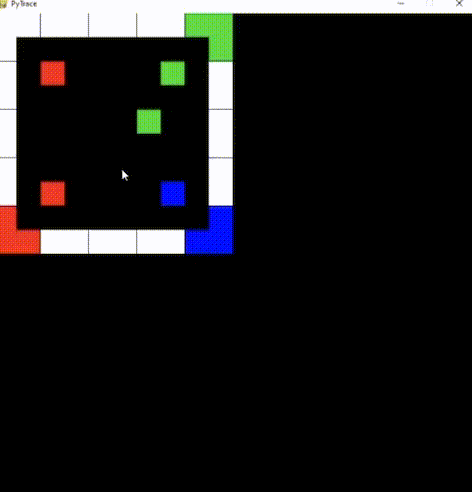

# PyTrace
* Graphical Engine that uses a 2D Ray Casting algorithm to estimate depth and project the illusion of a 3D space. 
* Written in Python using the Pygame module.
* Run the program, click to add tiles to the map, shift to change the color of the tile, when finished press m,
* WASD to move around in the rendered space.
* Initially the number of rays is quite low, pressing 1,2,3,4 will change the number of rays and the quality of the render.

## Demo

